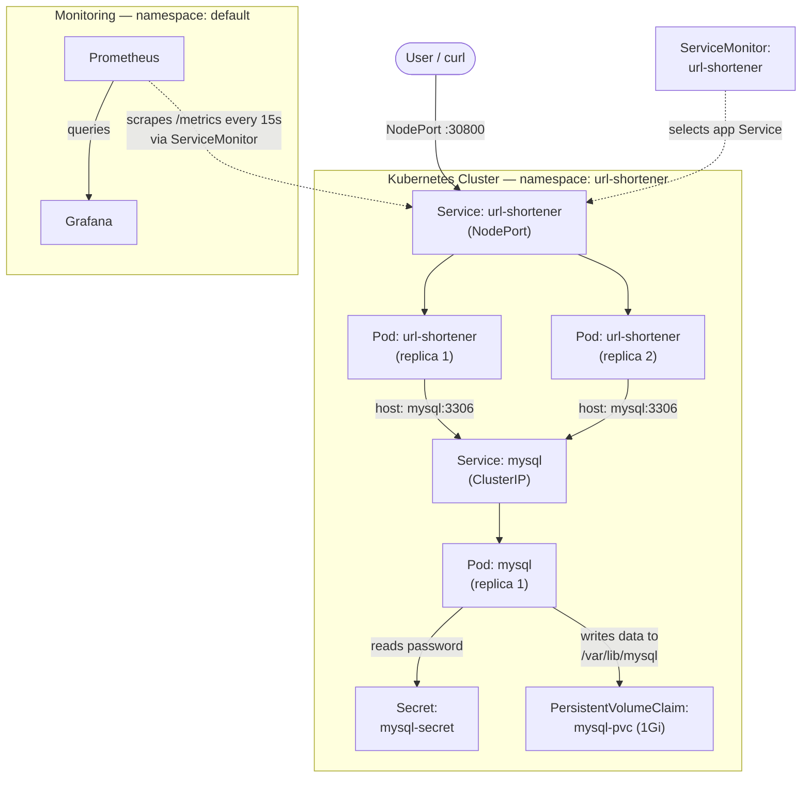
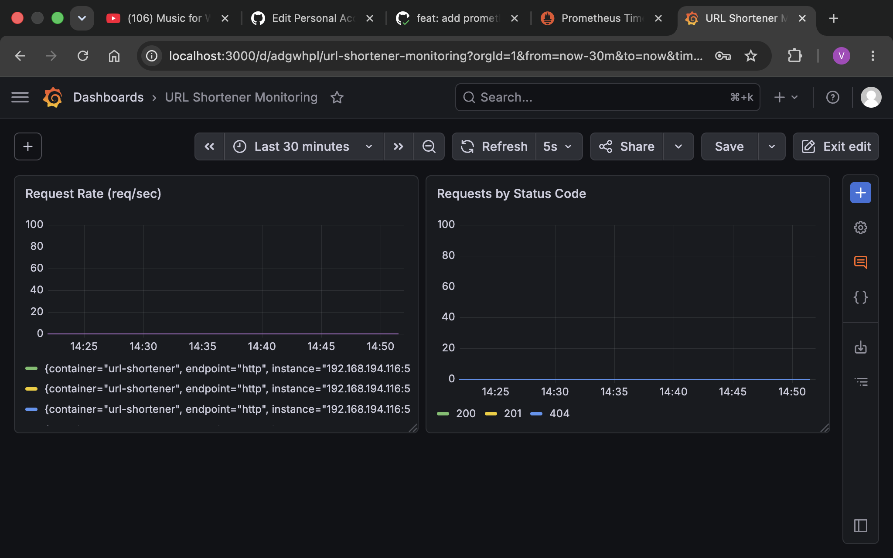
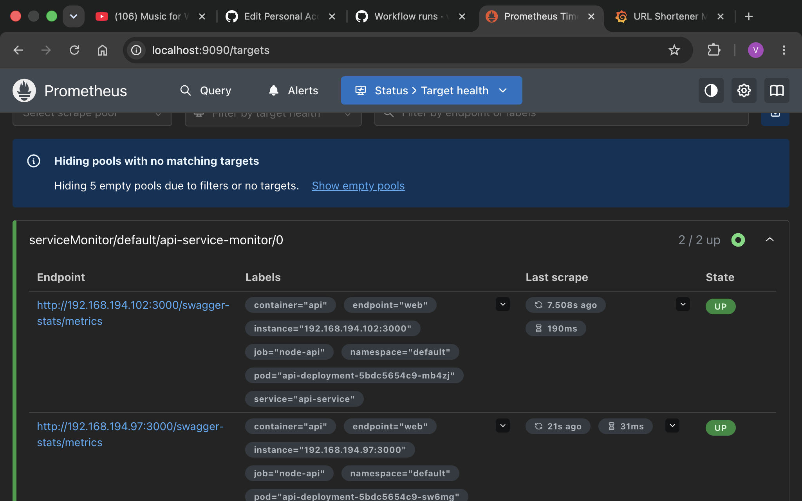
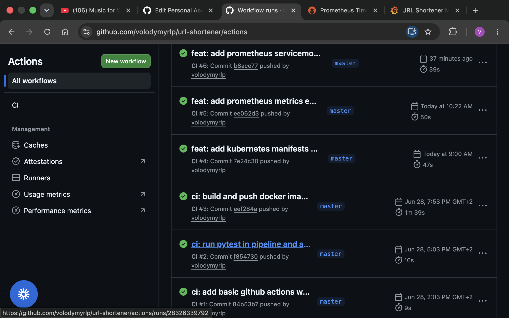

# URL Shortener

A production-style URL shortener built as a hands-on DevOps portfolio project. It takes the application through the full lifecycle: a Python/Flask service, containerization, an automated CI/CD pipeline, a complete Kubernetes deployment with a stateful database, and full observability with Prometheus and Grafana.


## Table of Contents

- [Overview](#overview)
- [Architecture](#architecture)
- [Tech Stack](#tech-stack)
- [Features](#features)
- [Screenshots](#screenshots)
- [API Endpoints](#api-endpoints)
- [Getting Started](#getting-started)
  - [Run Locally with Docker Compose](#run-locally-with-docker-compose)
  - [Deploy to Kubernetes](#deploy-to-kubernetes)
- [Monitoring](#monitoring)
- [Project Structure](#project-structure)
- [Development Phases](#development-phases)
- [Security Notes](#security-notes)

## Overview

This project is a working URL shortener: send it a long URL and it returns a short code; visit the short code and it redirects you to the original address. Click counts are tracked per link.

The point of the project is not the application itself (which is intentionally simple), but the **infrastructure and operations work around it**. Every layer that a real service needs is here: containerization, automated testing and image publishing, orchestration with self-healing and zero-downtime deploys, persistent storage, secret management, and metrics-based monitoring.

## Architecture

The application runs in Kubernetes with two replicas behind a Service, talking to a single-replica MySQL backed by persistent storage. Prometheus scrapes metrics from the app, and Grafana visualizes them.



**Request flow.** A request to `localhost:30800` hits the application's NodePort Service, which load-balances across the two app replicas. To create or resolve a short link, an app pod connects to the database over the internal cluster network using the Service name `mysql`. MySQL stores its data on a PersistentVolumeClaim, so the data survives pod restarts, and it reads its root password from a Secret rather than from the manifest.

**Monitoring flow.** A `ServiceMonitor` tells Prometheus (installed via the `kube-prometheus-stack`) to scrape the application's `/metrics` endpoint every 15 seconds. Grafana queries Prometheus to render the dashboards.

## Tech Stack

| Layer | Technology |
|---|---|
| Application | Python, Flask |
| Database | MySQL 8.0 |
| Database driver | PyMySQL |
| Containerization | Docker, Docker Compose |
| CI/CD | GitHub Actions |
| Image registry | GitHub Container Registry (ghcr.io) |
| Orchestration | Kubernetes (kind) |
| Metrics | prometheus-flask-exporter, Prometheus |
| Dashboards | Grafana |
| Testing | pytest |

## Features

- **Shorten URLs** — `POST /shorten` accepts a long URL and returns a generated short code.
- **Redirect** — `GET /<code>` redirects to the original URL and increments the click counter.
- **Health check** — `GET /health` for liveness checks.
- **Metrics** — `GET /metrics` exposes Prometheus-format metrics (request counts, durations, and exceptions).
- **High availability** — two application replicas behind a load-balancing Service.
- **Self-healing** — Kubernetes automatically replaces a pod if it dies, keeping the desired replica count.
- **Zero-downtime deploys** — rolling updates bring up new pods before terminating old ones.
- **Persistent data** — MySQL data is stored on a PersistentVolumeClaim that outlives the pod.
- **Secret management** — the database password is stored in a Kubernetes Secret, and the real Secret manifest is kept out of version control.

## Screenshots

**Grafana dashboard** — request rate and a breakdown of requests by HTTP status code, scraped live from the running application.



**Prometheus targets** — both application replicas discovered through the ServiceMonitor and reporting healthy.



**CI/CD pipeline** — automated GitHub Actions runs: tests followed by image build and publish.



## API Endpoints

| Method | Path | Description |
|---|---|---|
| `GET` | `/health` | Health check. Returns `OK`. |
| `POST` | `/shorten` | Create a short code. Body: `{"url": "https://example.com"}`. |
| `GET` | `/<code>` | Redirect to the original URL for the given short code. |
| `GET` | `/metrics` | Prometheus metrics endpoint. |

Example:

```bash
# Create a short link
curl -X POST http://localhost:30800/shorten \
  -H "Content-Type: application/json" \
  -d '{"url": "https://www.github.com"}'

# Follow the redirect for a returned code
curl -L http://localhost:30800/<code>
```

## Getting Started

### Run Locally with Docker Compose

This is the quickest way to run the full stack (app + MySQL) on your own machine.

```bash
# 1. Start the application and database
docker compose up -d

# 2. Create the database table (first run only)
docker compose exec app python db.py

# 3. Try it out
curl -X POST http://localhost:5000/shorten \
  -H "Content-Type: application/json" \
  -d '{"url": "https://www.github.com"}'
```

To stop everything:

```bash
docker compose down
```

### Deploy to Kubernetes

The Kubernetes manifests live in the `k8s/` directory. They assume a running cluster (the project was developed on `kind`) with the `kube-prometheus-stack` installed for monitoring.

```bash
# 1. Create the namespace
kubectl create namespace url-shortener

# 2. Create your Secret from the template
cp k8s/mysql-secret.yaml.example k8s/mysql-secret.yaml
# then edit k8s/mysql-secret.yaml and set a real password

# 3. Apply the database resources
kubectl apply -f k8s/mysql-secret.yaml
kubectl apply -f k8s/mysql-pvc.yaml
kubectl apply -f k8s/mysql-deployment.yaml
kubectl apply -f k8s/mysql-service.yaml

# 4. Apply the application resources
kubectl apply -f k8s/deployment.yml
kubectl apply -f k8s/service.yaml

# 5. Apply the monitoring resource
kubectl apply -f k8s/servicemonitor.yaml

# 6. Create the database table (first run only)
#    Replace <app-pod> with a real pod name from: kubectl get pods -n url-shortener
kubectl exec -it <app-pod> -n url-shortener -- python db.py
```

The application is then reachable on `localhost:30800` (NodePort).

A few useful checks:

```bash
# See all pods in the namespace
kubectl get pods -n url-shortener

# Roll out a new image with zero downtime
kubectl rollout restart deployment url-shortener -n url-shortener
```

## Monitoring

Monitoring is wired through the Prometheus Operator pattern.

The application exposes metrics automatically: adding `prometheus-flask-exporter` to the Flask app creates a `/metrics` endpoint that reports request counts, request durations, and exception counts, labelled by method, status, and endpoint.

A `ServiceMonitor` (in `k8s/servicemonitor.yaml`) selects the application's Service by its `app: url-shortener` label and tells Prometheus to scrape the `http` port at `/metrics` every 15 seconds. Because the `kube-prometheus-stack` is configured to pick up ServiceMonitors across all namespaces, no extra wiring is needed.

To view the dashboards, port-forward Prometheus and Grafana:

```bash
# Prometheus (targets, ad-hoc PromQL)
kubectl port-forward -n default svc/prometheus-kube-prometheus-prometheus 9090:9090

# Grafana (dashboards)
kubectl port-forward -n default svc/prometheus-grafana 3000:80
```

The Grafana dashboard contains two panels driven by PromQL:

```promql
# Request rate (requests/sec)
rate(flask_http_request_total{namespace="url-shortener"}[5m])

# Requests by status code
sum(rate(flask_http_request_total{namespace="url-shortener"}[5m])) by (status)
```

## Project Structure

```
url-shortener/
├── .github/
│   └── workflows/
│       └── ci.yml                  # CI/CD: tests, image build, publish to ghcr.io
├── k8s/                            # Kubernetes manifests
│   ├── deployment.yml              # App Deployment (2 replicas)
│   ├── service.yaml                # App Service (NodePort 30800)
│   ├── mysql-deployment.yaml       # MySQL Deployment (1 replica)
│   ├── mysql-service.yaml          # MySQL Service (ClusterIP)
│   ├── mysql-pvc.yaml              # PersistentVolumeClaim for MySQL data
│   ├── mysql-secret.yaml.example   # Template for the DB Secret (no real password)
│   └── servicemonitor.yaml         # Prometheus ServiceMonitor
├── docs/                           # Screenshots used in this README
├── app.py                          # Flask application (routes + metrics)
├── db.py                           # Database connection and table initialization
├── test_app.py                     # pytest tests (mocked, no DB required)
├── Dockerfile                      # Application image
├── docker-compose.yaml             # Local app + MySQL stack
├── requirements.txt                # Python dependencies
├── .dockerignore
└── .gitignore
```

## Development Phases

The project was built in six phases, each adding a layer of a real production system.

1. **Application** — a Flask service with shorten, redirect, and health endpoints, backed by MySQL.
2. **Containerization** — a Dockerfile for the app and a Docker Compose stack running the app alongside MySQL.
3. **CI/CD** — a GitHub Actions pipeline that runs the test suite, builds the image, and publishes it to GitHub Container Registry (ghcr.io) on every push.
4. **Kubernetes** — a full deployment: an app Deployment with two replicas and a NodePort Service, plus a stateful MySQL backed by a PersistentVolumeClaim, a Secret for the password, and a ClusterIP Service. Includes a verified self-healing experiment (killing a pod and watching Kubernetes recreate it with no downtime) and zero-downtime rolling updates.
5. **Monitoring** — a `/metrics` endpoint on the app, a ServiceMonitor so Prometheus scrapes it, and a Grafana dashboard visualizing request rate and status-code breakdown.
6. **Documentation and operations** — this README with an architecture diagram, plus database backup tooling.

## Security Notes

A few deliberate notes on how secrets are handled in this project:

- **Secrets are not committed to version control.** The repository contains `k8s/mysql-secret.yaml.example` as a template; the real `mysql-secret.yaml` is listed in `.gitignore` and must be created locally.
- **The database password is supplied via a Kubernetes Secret**, referenced by the MySQL Deployment through `secretKeyRef` rather than hard-coded into the manifest.
- **Kubernetes Secrets are base64-encoded, not encrypted, by default.** They keep a value out of plain sight and separate it from the manifest, but for a real production system you would layer on encryption at rest and a dedicated secrets manager (for example Sealed Secrets or HashiCorp Vault).
- The password used in this project is a throwaway value for a learning environment. In production, use a strong, unique, managed secret.
